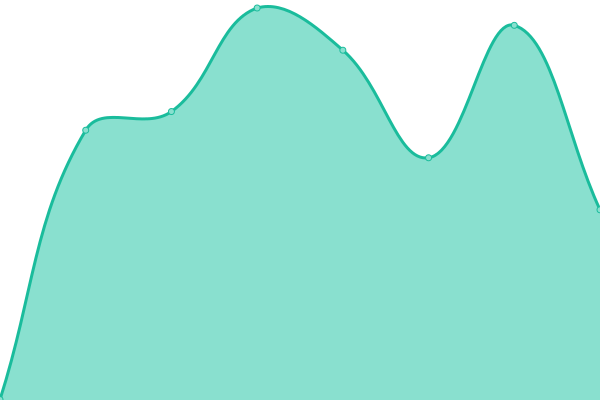
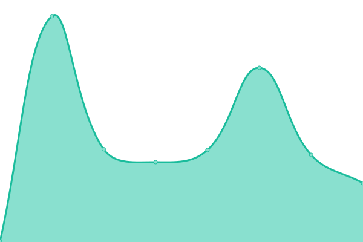

# [📈 現在の状況](https://kakkokari-gtyih.github.io/hana-status): <!--live status--> **全サービス稼働中**

This repository contains the open-source uptime monitor and status page for [かっこかり](https://kakkokari-gtyih.github.io/hana-status), powered by [Upptime](https://github.com/upptime/upptime).

With [Upptime](https://upptime.js.org), you can get your own unlimited and free uptime monitor and status page, powered entirely by a GitHub repository. We use [Issues](https://github.com/kakkokari-gtyih/hana-status/issues) as incident reports, [Actions](https://github.com/kakkokari-gtyih/hana-status/actions) as uptime monitors, and [Pages](https://kakkokari-gtyih.github.io/hana-status) for the status page.

## [📈 Live Status](https://demo.upptime.js.org): <!--live status--> **全サービス稼働中**

<!--start: status pages-->
<!-- This summary is generated by Upptime (https://github.com/upptime/upptime) -->
<!-- Do not edit this manually, your changes will be overwritten -->
<!-- prettier-ignore -->
| URL | Status | History | Response Time | Uptime |
| --- | ------ | ------- | ------------- | ------ |
|  [はなみすきー (Main)](https://misskey.flowers/healthz) | 稼働中 | [main.yml](https://github.com/kakkokari-gtyih/hana-status/commits/HEAD/history/main.yml) | 

 702ms
     
 | 

<a href="https://kakkokari-gtyih.github.io/hana-status/history/main">100.00%</a>
    

|  [はなみすきー (Data Storage)](https://s3.misskeyflowersusercontent.jp/media/f52c4676-5ede-4f42-a466-a50df29d911d.webp) | 稼働中 | [data-storage.yml](https://github.com/kakkokari-gtyih/hana-status/commits/HEAD/history/data-storage.yml) | 

 129ms
     
 | 

<a href="https://kakkokari-gtyih.github.io/hana-status/history/data-storage">100.00%</a>
    

|  [はなみすきー (Static Assets)](https://static-assets.misskey.flowers/) | 稼働中 | [static-assets.yml](https://github.com/kakkokari-gtyih/hana-status/commits/HEAD/history/static-assets.yml) | 

 1725ms
     
 | 

<a href="https://kakkokari-gtyih.github.io/hana-status/history/static-assets">99.71%</a>
    

<!--end: status pages-->

[**Visit our status website →**](https://kakkokari-gtyih.github.io/hana-status)

## 📄 License

- Powered by: [Upptime](https://github.com/upptime/upptime)
- Code: [MIT](./LICENSE) © [Anand Chowdhary](https://anandchowdhary.com), supported by [Pabio](https://pabio.com)
- Data in the `./history` directory: [Open Database License](https://opendatacommons.org/licenses/odbl/1-0/)
